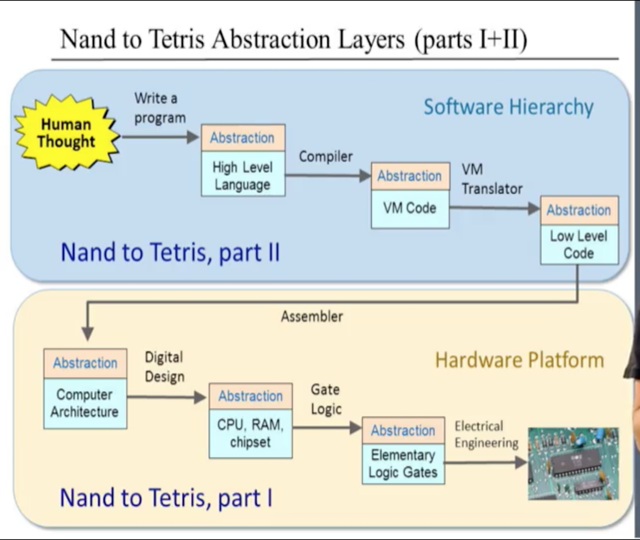

# [Build a Computer from First Principles](https://www.coursera.org/learn/build-a-computer)

### Summary of Projects which built upon each other
* project 1: **Logic Gates** -> Starting from an elementary [NAND](https://en.wikipedia.org/wiki/NAND_gate) logic gate, built an array of more complex logic gates, i.e., And, Or, Mux, Xor, etc.
* project 2: **ALU** -> Constructed an adder chip and ALU, which executes all the arithmetic and logical operations
* project 3: **Registers & Program Counter** -> Used a D [Flip Flop circuit](https://en.wikipedia.org/wiki/Flip-flop_(electronics)), which enables storing state in a chip, to construct a series of registers and a [Program Counter](https://en.wikipedia.org/wiki/Program_counter)
* project 4: **Assembly** -> Wrote Assembly Language programs using the Hack Machine Language
* project 5: **Full Computer** -> Constructued CPU, ROM, and RAM units leading to a full scale Computer
* project 6: **Assembler** -> Created Hack assembler in Python to translate Hack Assembly Language into Hack Binary Machine Language
* project 7 & 8: **VM Translator** -> Started Two-Tier compilation process by building Virtual Machine Translator of a Jave-like, stack-based Bytecode into Hack Assembly Language
* project 9: **Jack Language** -> Created a personal finance command line program in Jack, a Java-like langauge used for this course
* project 10 & 11: **Compiler** -> Finished two-tier compilation process by implementing compiler for translation of high-level Jack language into VM langauge, akin to Java bytecode
* project 12: **Operating System** -> Wrote Operating System classes to "ship" with Hack / Jack platform to provide an interface for high-level Jack programmer to low-level resources, i.e, memory allocation
