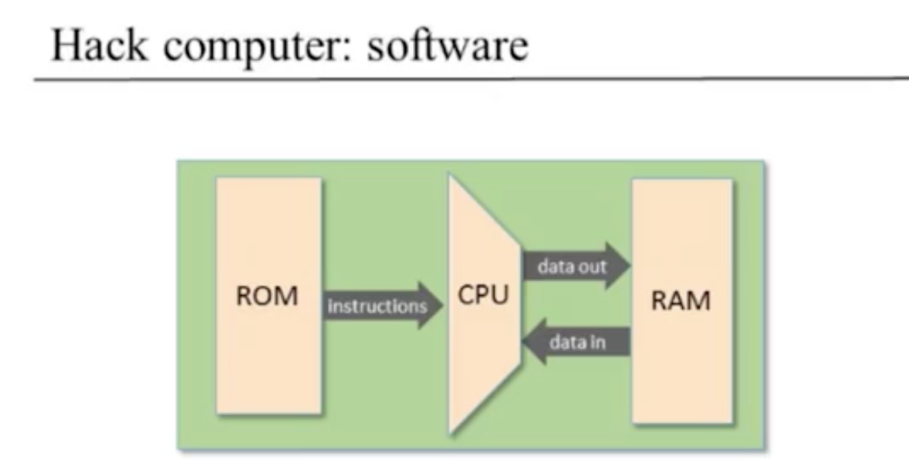

# Machine Language
* overview of computer from user's point of view before finishing building computer

##### Overview

* most machines only do 1 thing, i.e., a washing machine doesn't cook spaghetti
* universal turing machine -> same hardward can run many different software programs
* **machine language** enables **directly manipulating machine** and **highly specific optimizations** but not useful for most programmers
* Mnemonics
  * Machine language is really all binary, but too difficult for humans
  * Assembly Language makes much easier for humans to reason about manipulating machine
    * this "symbolic form" doesn't really exist but is just a convenient mnemonic to present machine language instructions to humans
    * assembler -> converts from assembly language to bits

##### Machine Language Elements
* Machine Language most important interface -> communication between software and hardware
  * designed to **manipulate** a **memory** using a **processor** and a set of **registers**
* Machines
  * Memory -> collection of hardware devices that store data and instructions in a computer
    * from a programmer's perspective, **all memories** have **same structure**: **continuous array of cells of some fixed width**, also called words or locations, each having a **unique address**
  * Processor -> usually known as Central Processing Unit, device capable of performing a fixed set of elementary options
    * arithmetic and logic operations, memory access operations, and control (branching)
    * operands are binary values that come from registers and selected memory locations
    * likewise, results of the operations (processor's output) can be stored in either registers or selected memory location
  * Registers
    * CPUs contain a few, easily accessed, "registers"
    * location in processor's immediate proximity enables high-speed data manipulation
    * number and functions are a central part of the architecture
      * **Data Registers** -> contain **values**
        * Add R1, R2
      * **Address Registers** -> contain **address** where to load a value
        * Store R1, @A

* Memory Hierarchy

  * **accessing memory** is **expensive**
    * need to supply long address to get value at memory location
    * then need to get the memory contents into CPU, which is expensive
  * **Solution** -> series of increasing memory sizes starting from Registers in CPU to Cache to Main Memory to Disk
    * at each level, distance from CPU, memory size, and overall performance time increases
  * Addressing Modes
    * Register
      * Add R1, R2 -> R2 + R1
    * Direct
      * Add R1, M[200] -> Mem[200] + R1
    * Indirect
      * Add R1, @A -> Mem[A] + R1
    * Immediate
      * Add 73, R1 -> R1 + 73
  * Input / Output
    * CPU needs some kind of protocol to talk to each of them
    * **Software "Drivers" know protocols to enable communication between input / output**
      * one general method of interaction uses "memory mapping"
        * Memory Location 12345 holds the direction of the last movement of the mouse
  * Flow Control -> loops

##### The Hack Computer and Machine Language

* 16-bit machine -> atomic unit of machine is 16 bits
  * everything consists of chunks of 16 bits
  * if you want to store / retrieve / move, etc. need to do it in units of 16 bits
  *
