# Computer Architecture
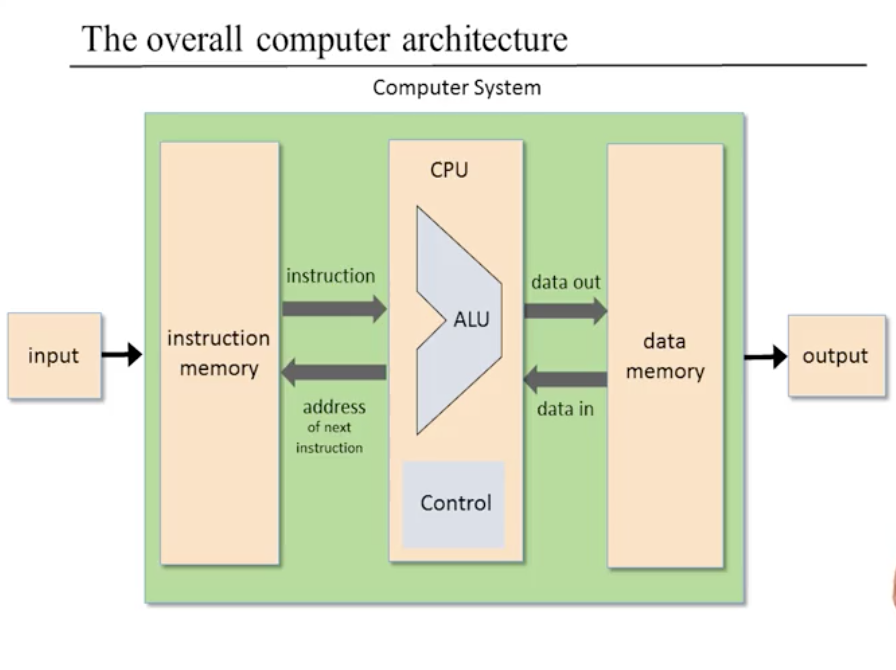

### Turing
* [Turing Machine](https://www.youtube.com/watch?v=dNRDvLACg5Q) -> machine that has some state and logic, and uses the two to manipulate strings of 1s and 0s
  * in theory, anything a modern computer can do, a turing machine can do
  * abstract, used mainly in theoretical computer science
  * Universal Turing Machine -> different parts of tape contain instructions for how machine should behave to imitate another machine
    * really just **programmable computer** and the **description** on the **tape** of another Turing machine is a **software program**
  * [Turing Complete](https://medium.freecodecamp.org/javascript-is-turing-complete-explained-41a34287d263)
    * Turing Complete -> **concept** that means any "thing"(physical or virtual) that takes any program and can run it is Turing Complete
    * programming languages are turing complete if they can run "any program" that a Turing machine can run given enough time and memory
    * calculator -> example of a Turing **incomplete** machine because it can only perform a small pre-defined subset of calculations
    * personal computer (like Mac or PC) -> Turing **complete** because can do any calculation that a Turing machine can do given enough time and memory

### Von Neumann Architecture
* von Neumann machine -> practical architecture and conceptual blueprint of almost all computer platforms today
  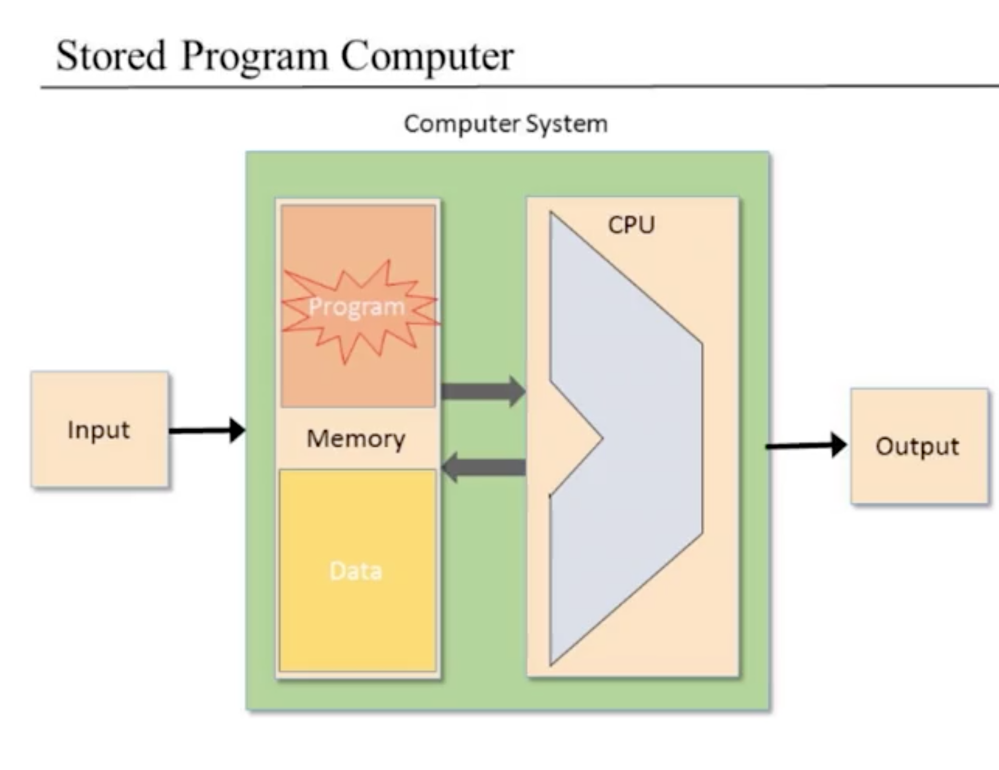
  * stored program concept -> enabled machine with fixed hardware to perform an infinite number of tasks
    * logic of instructions is not embedded in hardware like in mechanical computers pre-dating 1930s
    * **logic temporarily stored** and **manipulated** in the **computer's memory**, just like data, **becoming** what is known as **"software"**
    * since the **computer's operation manifests** itself to the user **through the currently executing software**, the **same hardware platform** can be made to behave **completely differently** each time it is **loaded with a different program**
  * Elements -> **CPU, interacting with a memory device, receiving data from some input device and sending data to some output device**
    * CPU -> in charge of executing the instructions, i.e., which calculation to perform, of the currently loaded programs
      * **ALU** -> low-level arithmetic and logical operations
        * functionality of ALU function of need, budget, energy, etc.
        * any functionality desired can be implemented at software(slower) level later
      * **Registers** -> in order to **boost performance**, CPU equipped with high-speed "resident" registers to **store intermediate results**
        * used instead of shipping intermediate results in and out of CPU to RAM
        * prevents **starvation** -> when **processor denied resources** it needs to complete work
        * since few registers in CPU, identifying one of them requires only 1 instruction and clock-cycle compared to Hack RAM which requires 2
        * term "Register" used liberally to refer to any device capable of storing a chunk of bits
        * Data -> registers that store temp results in CPU
        * Address -> contains address of register we wish to manipulate
          * output connected to input of memory device -> side-effect of making register available to subsequent instructions designed to manipulate it
        * Program Counter -> keeps track of address of the instruction to be fetched and executed next
      * **Control Unit** -> decodes computer instruction to signal to various hardware devices how to execute instruction
        * responsible for figuring out which instruction to fetch and execute next
    * Memory
      * **Physical** perspective -> linear sequence of addressable **registers**, each having a unique address and value, which is a **fixed-size** word of information
      * **Logical** perspective -> Data + Program
        * Data -> arrays and objects of programs that are currently executing
        * Program -> dedicated for storing programs' instructions
        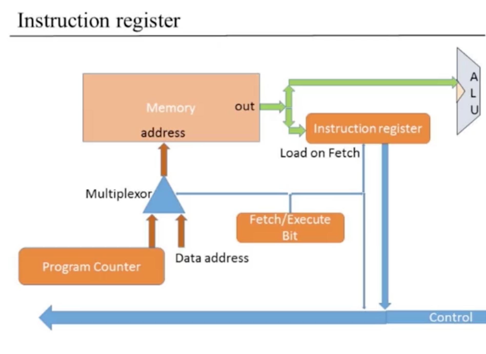
      * some architecture variants have the data and instruction memory managed within same phsyical memory unit
      * Harvard (and Hack) architectures separates them into distinct address spaces
      * **ALL memory registers**, irrespective of roles, are **accessed** in same way: **supply address to select register**
        * **Random Access Memory** -> each randomly selected register can be accessed in **same access time irrespective of memory size and register's location**
  * 3 data buses that supply data as input to elements and take outputs to store
    * control, address, data
  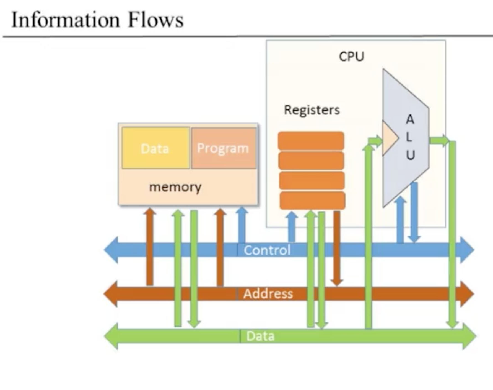
  * Input / Output Devices
    * computers can interact with an array of diverse devices
    * don't concern ourselves with low-level implementation details of each because:
      * requires engineering understanding of each
      * all **devices look the same** to the computer with **Memory-Mapped I/O**
    * programmatically, **key implication** -> computer **programs** can **access** any **I/O device** by simply **manipulating selected registers** in their **designated memory areas**
    * several agreed upon contracts required for this power:
      * mapping of 2-dimensional grid of pixels into 1-dimensional fixed-size memoery registers
      * each I/O device required to support a predictable interaction protocol so programs can interact with it in a predictable manner
        * standards play crucial role in determining these low-level contracts

### The Fetch-Execute Cycle
* Basic CPU Loop managed by Control Unit
  * decode the current instruction
  * execute it
  * figure out which instruction to execute next
  * fetch it, decode it, etc.

### CPU
* Hack CPU: Abstraction
  * 16-bit processor, designed to bring "program to life"
    * executes current instruction
    * figures out which instruction to execute next
* Hack CPU: Implementation
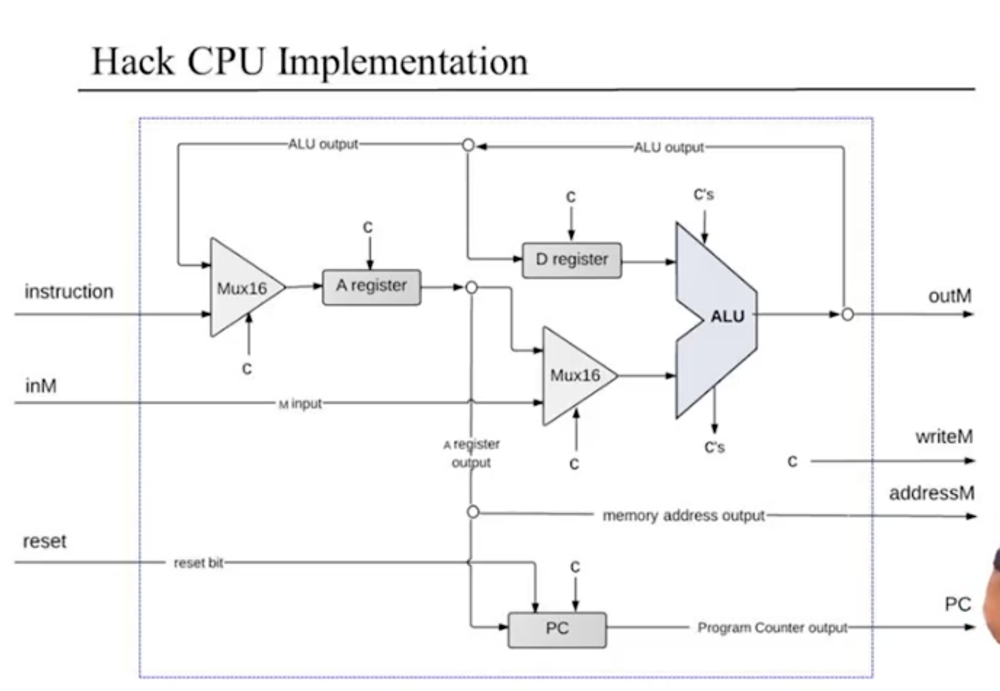
  * inputs
    * A-instruction or C-Instruction
      * msb serves as opt code to distinguish between 2
    * inM -> value of currrently selected register in data memory
    * reset bit -> whether or not to reset program
  * outputs
    * addressM -> in which address to write?
    * outM -> what to write to addressM
    * writeM -> write to memory?
    * pc -> address of next instruction
  * jump bits used to manipulate program counter

### The Hack Computer
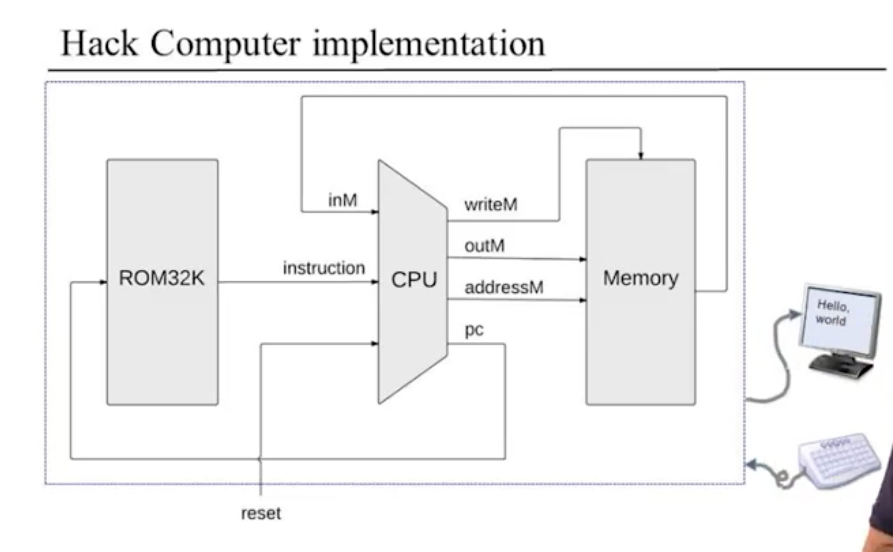
* done by connecting following:
  * ROM -> "Read Only Memory" that serves as **instruction memory** of computer
    * **output** of **PC** fed to **ROM** as **input**
    * program needs to be loaded here which can be done either via:
      * "cartridge like loading", like an N64 cartridge, for which you remove and add physical ROM each time to run new program
      * software-based hardware simulator that loads chip
  * CPU
  * RAM -> Data Memory
    * special chips used for Screen and Keyboard
      * Keyboard -> normal RAM with nice side-effect that outputs current key pressed
      * Screen -> normal RAM with nice side-effect that any bit written to it is reflected as a pixel on the physical screen

### Perspectives
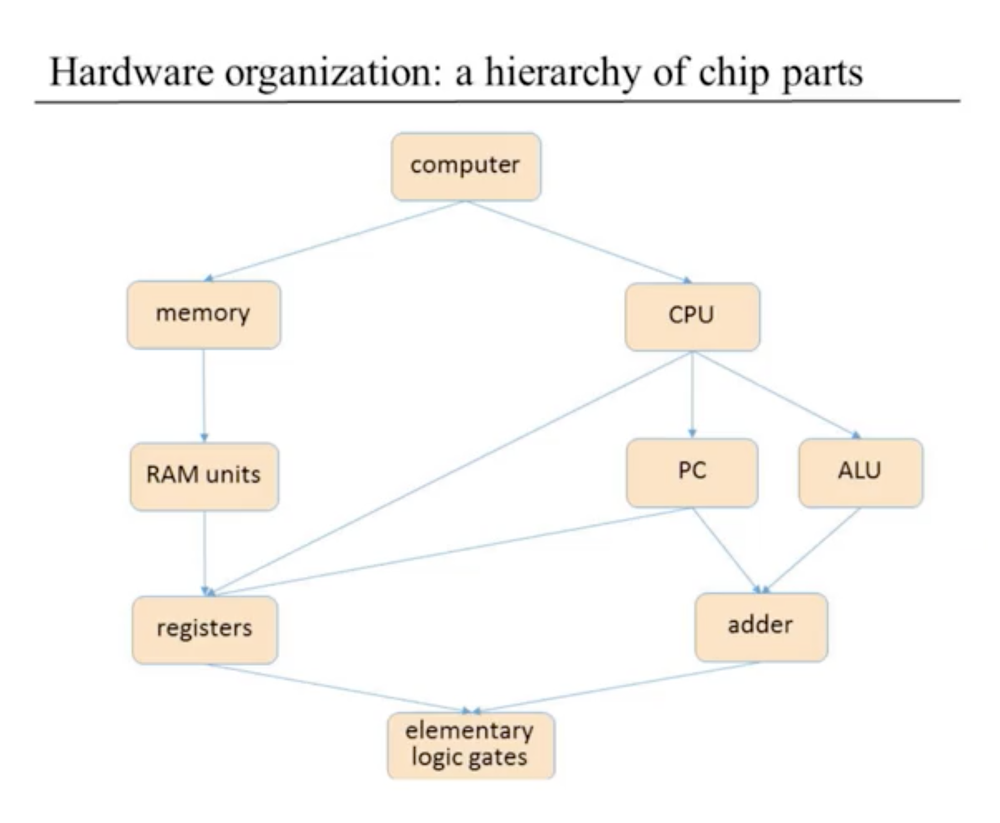
* Hack computer makes use of Harvard Architecture(flavor of von Neumann) whicd splits data and instruction memories
  * implementing class von Neumann Architecture would require computer to do different things at different times
    * requires implementing a **finite state machine** and having a corresponding register to maintain state
    * output of computer depends on input and current state
* I/O peripherals in real computers have dedicated hardware (computers) for them to remove responsibilities from CPU
  * i.e., screen has a graphics card

### Projects

##### CPU -> "Data Processing Powerhouse"
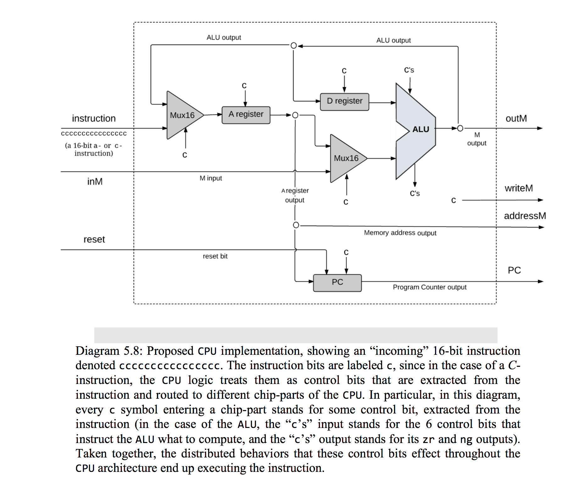

##### RAM -> "Data Memory Storage Unit"
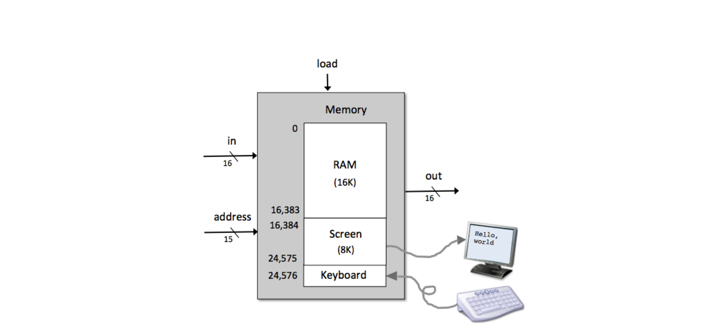

##### ROM32K -> "Instruction Memory Storage Unit"
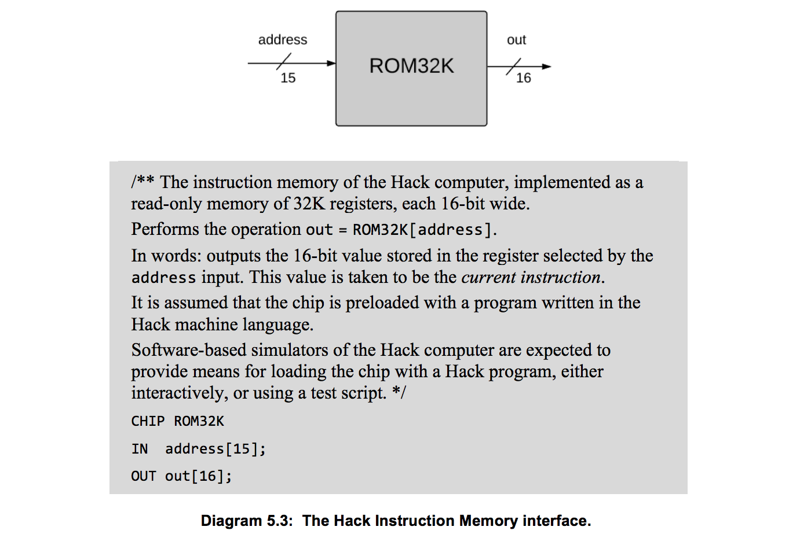

##### Computer
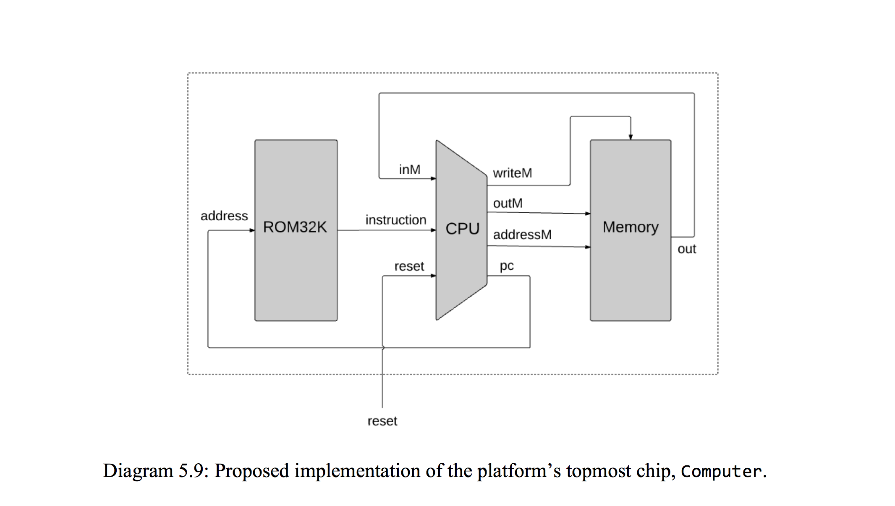
