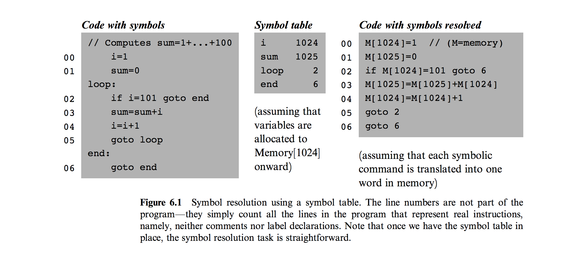

# Assembler
* every computer has **binary machine language** of 1s and 0s and a **symbolic machine language, aka assembly language**

### Assembly Languages and Assemblers
* Assembler -> translates symbolic machine language to binary 0s and 1s; essentially "text-processing program"
  * usually **first software layer** in computer
  * **2 flavors of symbols** in general:
    * Variables
      * automatically **assigned to memory addresses** by translator
        * actual values of these addresses is insignificant so long as each **symbol** is **resolved to the same address throughout the program's translation**
    * Labels
      * marking locations in program with symbols
      * i.e., label loop that a program can goto later conditionally or unconditionally
  * looks up symbols in symbol table with **symbols mapped to phsyical addresses in RAM**
  
  * **assembly command** may translate into **several machine instructions** and thus end up occupying **several memory locations**
    * assembler keeps **track** of **how many words** each source command generates
  * when **allocating memory space for variables**, translator must take into **account** both their **data type and the word width (i.e., 16 bits) of target hardware**
* instead of having to write program in Machine Language on Hack computer, can write program on our computers
  * **cross-compiler** -> program running on 1 computer **producing code for another computer**
* full documentation must be given of assembly syntax / api and respective binary codes

### Hack Assembly
* approach for translating A and C instructions, assembler without symbols and thenassembler with symbols
* Symbols
  * variables -> represent memory locations where the programmer wants to maintain values
    * don't actually care about about memory location, just care that always same memory location and correct value
    * these types of symbols one of most beautiful abstractions of programming
  * labels -> represent destinations of goto instructions
    * declared by pseudo commands of (LABEL)
    * directive defines symbol LABEL to refer to memory location holding the next instruction in program
  * pre-defined symbols -> represent special memory locations
    * only A instructions

### Perspective
* Macro Assembler / Commands -> translate compact instructions into valid hack commands
  * requires extending assembler
* How to Write Assembler for First Computer?
  * translate assembler by hand to machine code and then use that computer from then on
