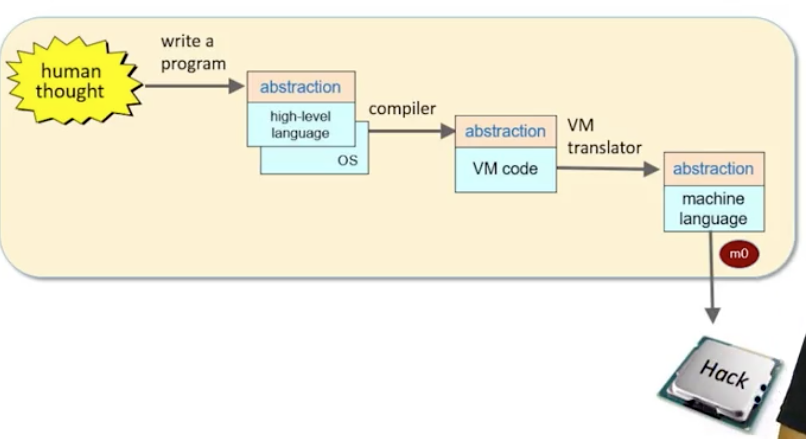
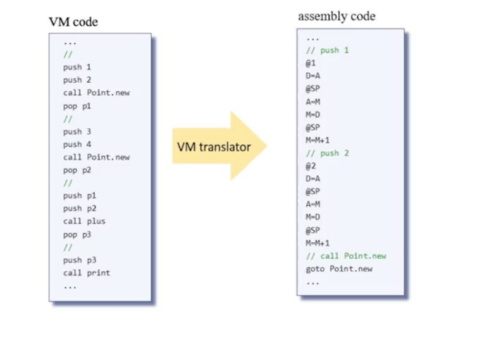
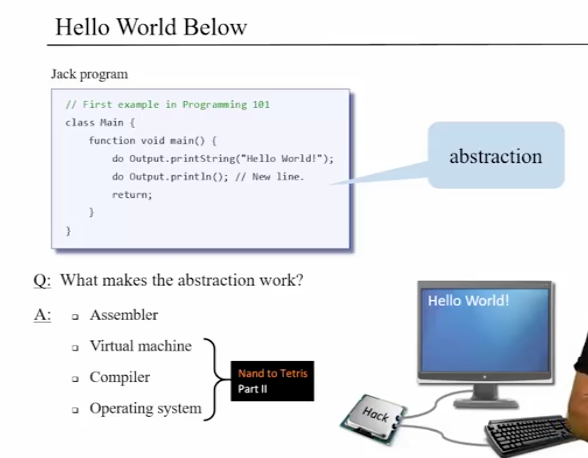
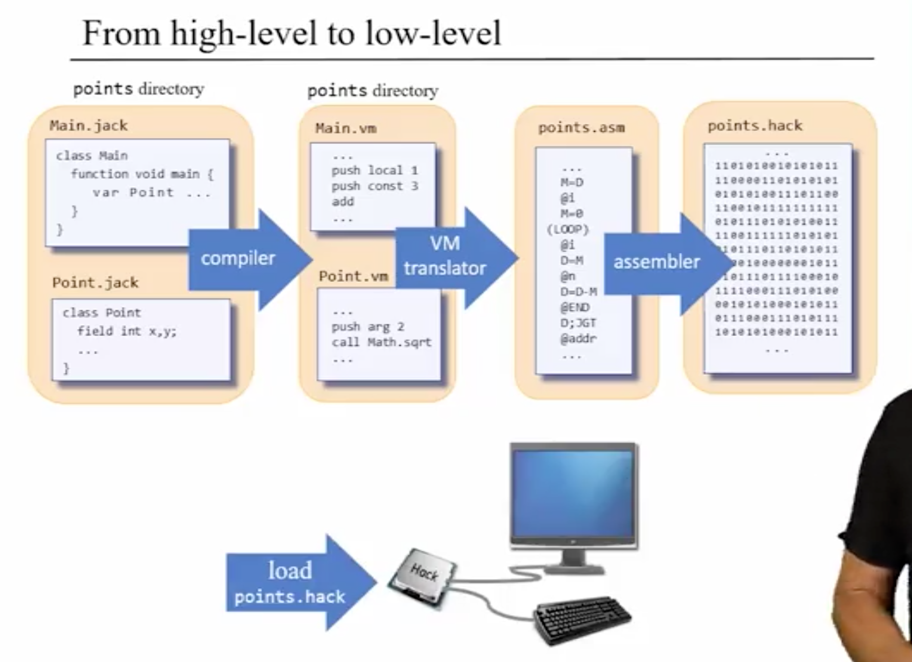
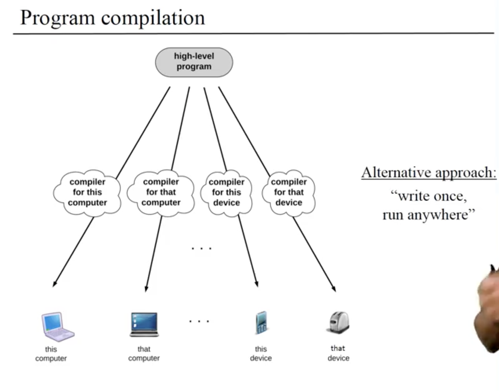
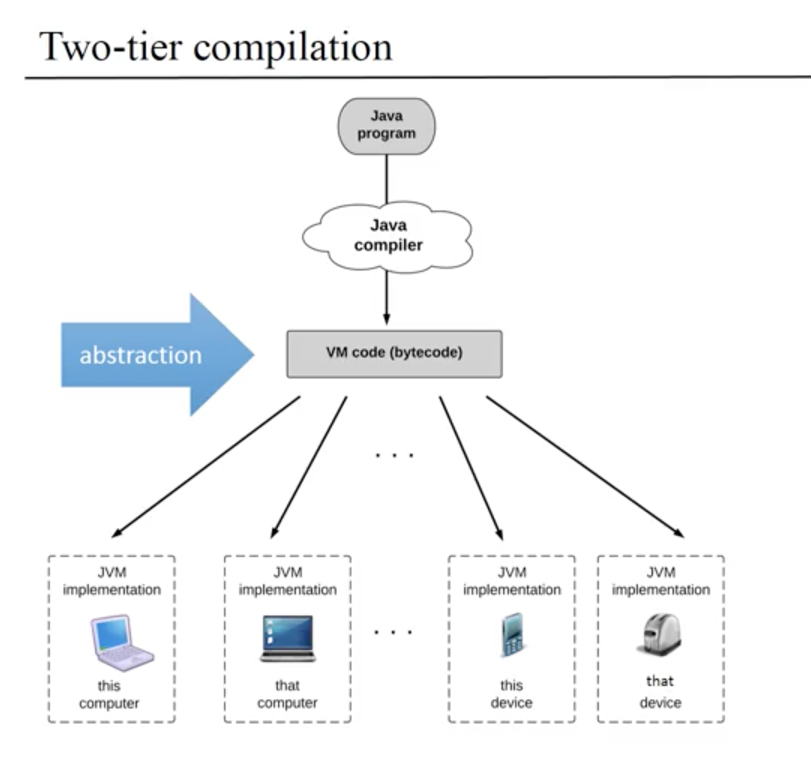
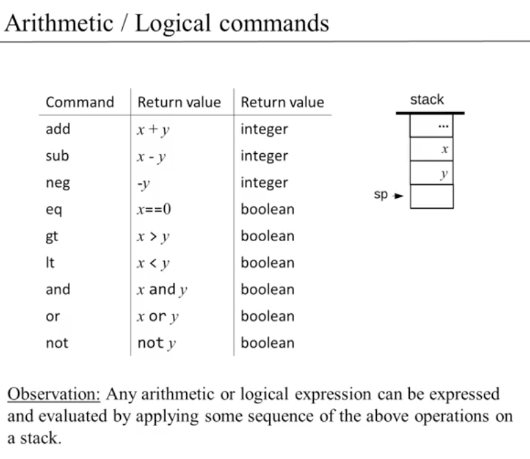
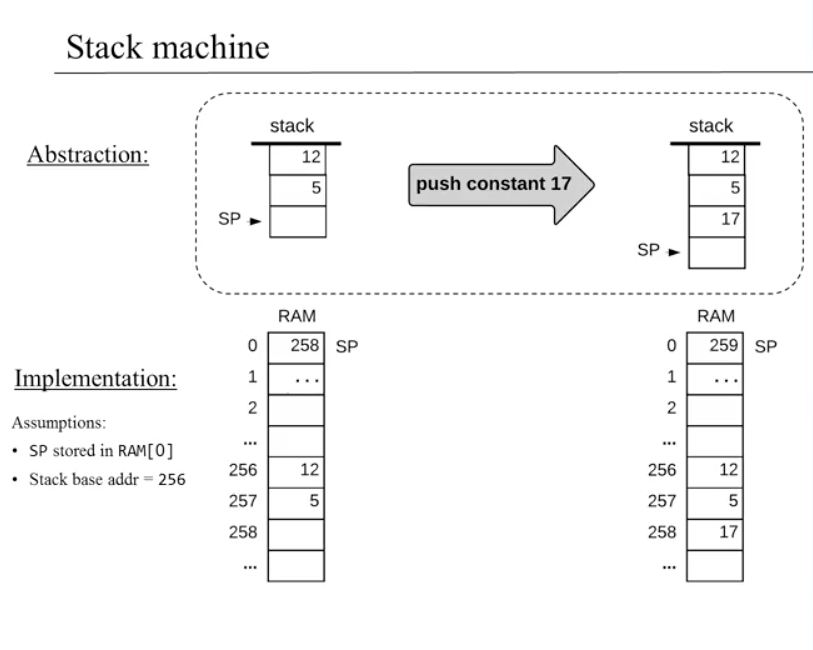
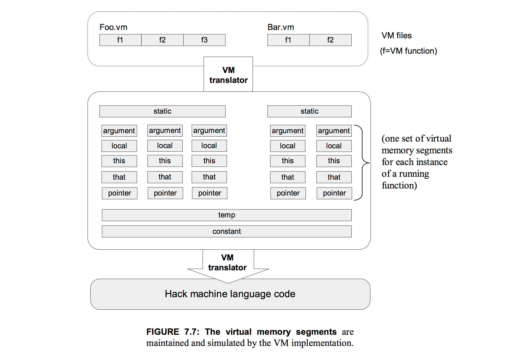

# Module 0: Machine Language

### Overview

* part of course where **software meets hardware**
* use **hardware** through its **interface** -> **machine language**
  * machine language is specific to hardware

### VM Code to Assembly

* reviewed Part I, week 4 for Hack Asssembly language

# Module 1: Virtual Machine I - Stack Arithmetic

### Overview

* part II more demanding than part I
* application developers shouldn't have to worry about low-level details when writing programs otherwise would take forever
* that said, having **mental model** and general **intellectual curiosity** very important

### Program Compilation Overview
* we have high-level program that needs to be compiled to machine code of computer

* problem: world has many different computers -> different processors -> different machine langauges
  * not enough to write 1 compiler only, have to write many
    * "direct compilation" process, high-level C to machine code, can only run on machine architecture for which it was compiled
      * assembly / machine specific to processor
      * best option when performance and efficiency are wanted because fewer intermediat stpes (VM adds a constant overhead at best)
    * [C Compilation Process](https://www.calleerlandsson.com/the-four-stages-of-compiling-a-c-program/)
      * **Preprocessing** -> analyzes preprocessor commands, lines starting with `#`, are **macros** which form **own language**
        * **practically** -> **inlines libraries**, i.e., `<stdio.h>`
      * **Compilation** (name is confusing) -> **C code to assembly specific to target processor architecture**
        * **allows** for C programs to contain **inline assembly instructions**
        * some C compilers include integrated assemblers avoiding the need to invoke an assembler and this intermediate stage
      * **Assembly** -> assembler used to translate the **assembly to machine code** (also known as object code)
      * **Linking** -> **rearrange machine code**
        * linker -> arranges pieces of machine code so that functions in some pieces can call functions in other pieces
        * final stage, produces executable
  * **alternative: "write once, run anywhere"**
    * Java is 1 really good example of this
      * employs **"Two-tier" compilation** -> **decouples compilation process** -> simpler than "direct approach" like C/C++
        * Compiler -> VM Code
          * in case of Java, called Java bytecode
        * VM Code -> Assembly
          * VM code fed to JVM implementation then run through Assembler to machine code
      
      * [JIT Compilation](https://aboullaite.me/understanding-jit-compiler-just-in-time-compiler/)
  * Jack Compilation
* Virtualization
  * **virtual machine** -> **imaginary artifact**
    * instructions are the intermediate steps into which high-level commands are decomposed
  * vital for modern cloud computing and networks
  * **programs** that can **reason about programs**

### VM Abstraction: The Stack
* overview of familiar stack data structure and its API
* stack commands used to transfer data to and from memory to stack in VM
  * stack commands come from compiler

### VM Abstraction: Memory Segments
* high-level program has variables with roles, i.e., static, local, argument
  * stack machine keeps track of these with memory segments
* memory access commands -> manipulate 1 of 8 separate virtual memory segments
  * push segment index -> push the value of segment[index] onto stack
  * pop segment index -> pop the top stack value and store it in segment[index]

### VM Implementation: the Stack

* pointer manipulation
  
  * memory location that p points at
  * indirect addressing operation

### VM Implementation: Memory Segments

* normal for parts of stack to contain values "not in play" (can be overwritten)

### VM Emulator
* allows us to test high level programs
  * runs VM code on Hack Computer
* shows VM both in abstraction and implementation on host program

### Perspective
* history of personal pcs
  * in 1970s, ibm and apple came with first personal computers
  * at the time, Pascal was a popular programming language but it could only be run on mainframes
  * compilers were written to translate Pascal to work on these various processors -> meant that software developers had to maintain multiple versions of compilers and software
    * "porting" challenge
  * pico virutal machine -> processing abstraction that could work on many platforms
* spirit of our VM similar to JVM
  * Java currently runs most android apps
* vm translator critical to be efficient
