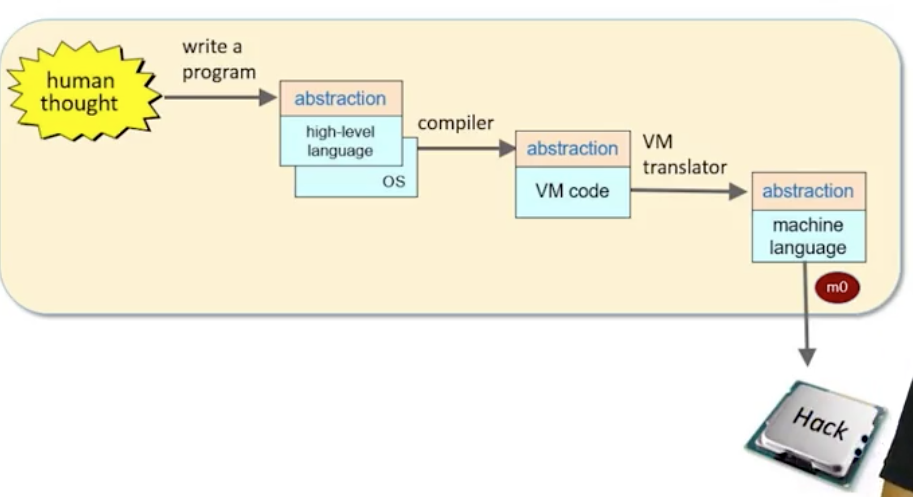
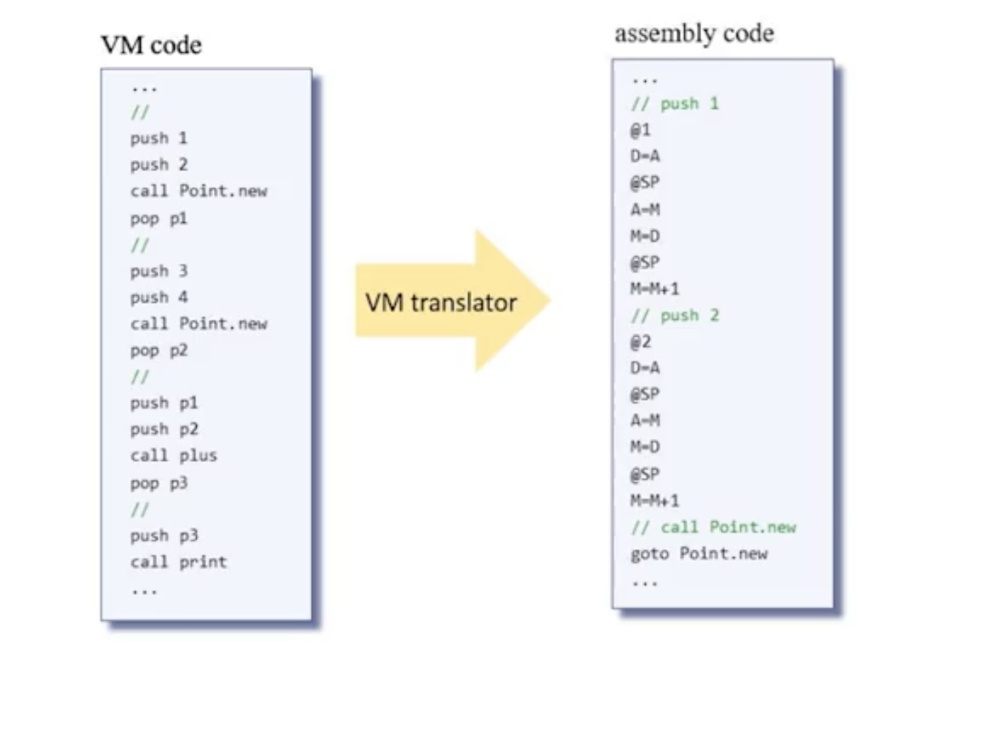
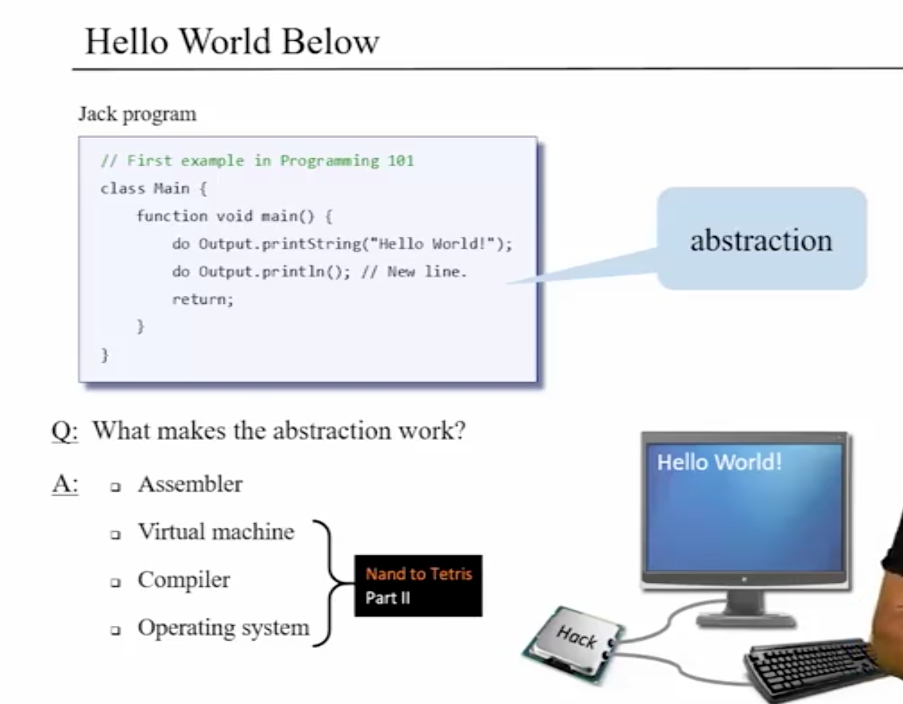
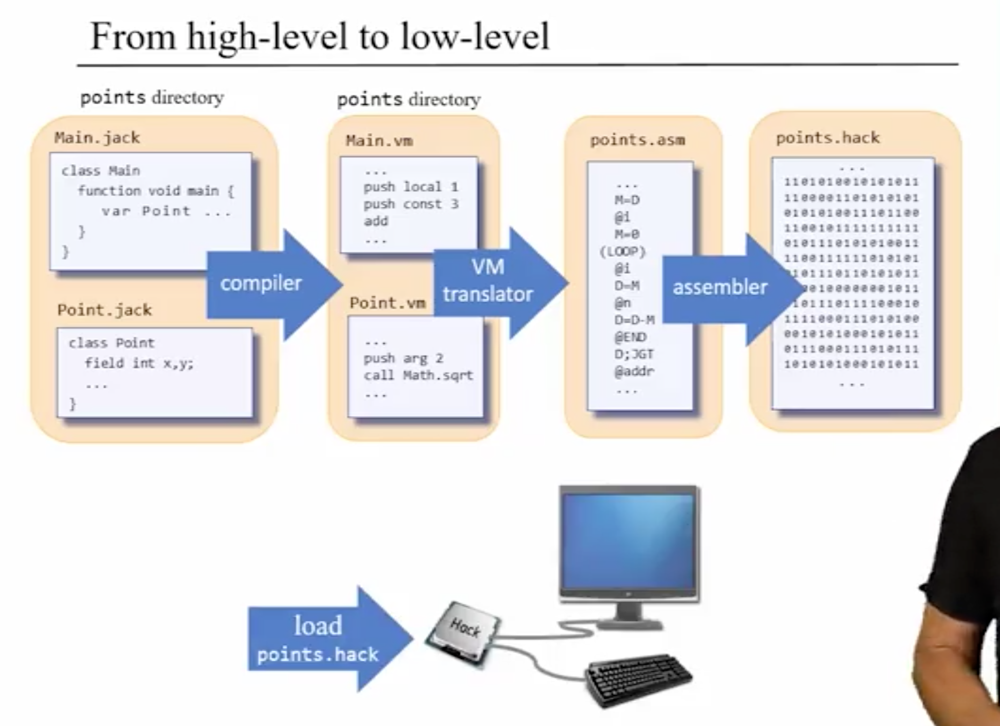
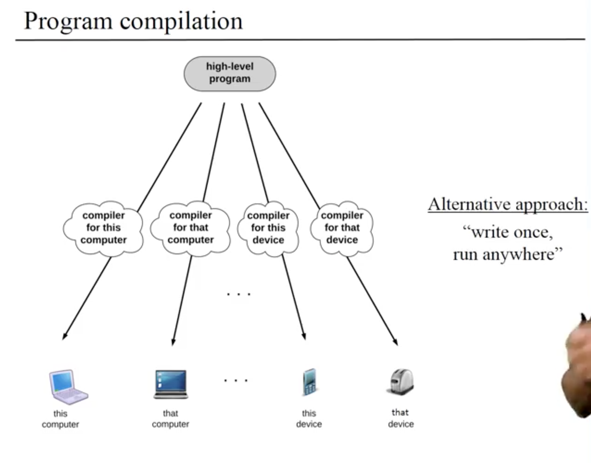

# Module 0: Machine Language

### Overview

* part of course where **software meets hardware**
* use **hardware** through its **interface** -> **machine language**
  * machine language is specific to hardware

### VM Code to Assembly

* reviewed Part I, week 4 for Hack Asssembly language

# Module 1: Virtual Machine I - Stack Arithmetic

### Overview

* part II more demanding than part I
* application developers shouldn't have to worry about low-level details when writing programs otherwise would take forever
* that said, having **mental model** and general **intellectual curiosity** very important

### Program Compilation Overview
* we have high-level program that needs to be compiled to machine code of computer

* problem: world has many different computers -> different processors -> different machine langauges
  * not enough to write 1 compiler only, have to write many
  * alternative: "write once, run anywhere"
    * Java is 1 really good example of this
      * employs "Two-tier" compilation -> decouples compilation process which makes each simpler than "top-to-bottom" approach like C++
        * Compiler -> VM Code (in case of Java, Java bytecode)
        * VM Code -> fed to JVM implementation then run through Assembler to machine code
      
  * Jack Compilation
* Virtualization
  * virtual machine -> imaginary artifact
  * vital for modern cloud computing and networks
  * programs that can reason about programs

