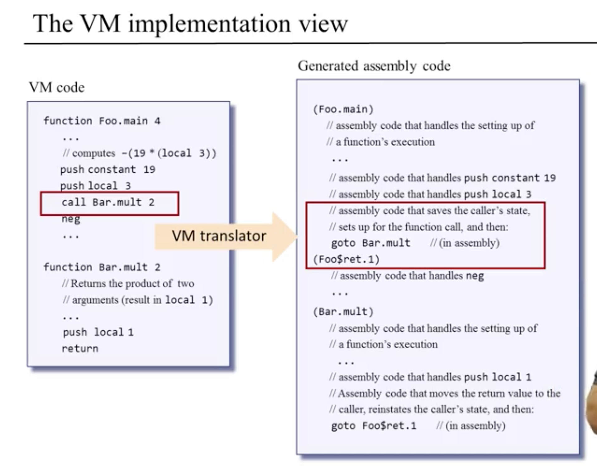

# Module 2: Virtual Machine II: Program Control

### Overview
* adding **functionality** for:
  * **program flow commands** for handling **conditional and unconditional branching**
  * function commands for handling **subroutines**
    * subroutine -> **sequence of program instructions** that perfroms a specific task, **packaged as a unit**

### Stack-Based Implementation

* call-and-return logic -> **hierarchical structure** where called **subroutine must finish** its execution before the caller can resume its own execution
  * **stack of active subroutines**
  * each subroutine must maintain its **private set of local variables, argument values, pointers, and so on -> method frame**
  * everything put on **global stack**
* **VM implementation maintains** global stack and implements call-and-return mechanism

* **Return Address**
  * **jumping to called subroutine** is rather easy -> **resolve name to a memory address and jump there**
  * **return specifies no return address**, as they are **meant to serve many unknown callers**
    * interpreted as: redirect the program's execution to the command following the command that called the current subroutine, wherever this command may be in the program's code
      * memory location to which we have to return to -> **return address**
      * return address **saved in method frame** before calling subroutine and popped upon returning

* **Parameter Passing Protocol**
  * caller pushes arguments to subroutine before pushing them onto the stack
  * called subroutine pops arguments from stack as needed and carries out computation
  * pushs return value onto the stack

* Local Variables
  * need to be maintained for each subroutine, including one's below another subroutine on the call stack

### Subroutine Calls
* high-level operations
* typically referred to as a "call operation"
  * **caller** -> parts of program that calls the subroutine, treating it like any other basic operation in the language
    * **abstraction**
      * assumes the code of the **subroutine** will get **executed -- somehow** --
      * and **following** the subroutine's **termination** the **flow of control will return -- somehow** -- to the next instruction in the caller's code
    * the **more abstract** the **high-level**, the **more work** the **low level** must do
* be able to handle subroutines calling other subroutines and calling itself (recursion) -> stack grows

### Branching

* generally computer programs execute one command after another except when using a "goto command" to jump to some other part of the program
* "if-goto destination" used for implementing conditionals if / else and while
* similar constructs exist in VM language and Assembly making this translation relatively easy

### Functions

* **key idea**
  * function **call places** all arguments on the stack
  * function **return removes** all arguments from stack; only the result remains on stack

### Function Call and Return

* Function Execution
  * during a given point of time, usually only a few functions are executing
  * **calling chain** -> all the functions the participate in the chain of execution
    * **everyone has some state, some private world**

### Perspective
* Java / C# **two-tier compilation** approach **safety** compared to C++
  * can inspect intermediate VM code more easily than machine code
  * VM implemntation acts as **sandbox / security layer** before access is given to delicate resources, i.e., host RAM

### [Ruby JIT](https://www.youtube.com/watch?v=svtRUkD0ACg)
* TODO once finish project
