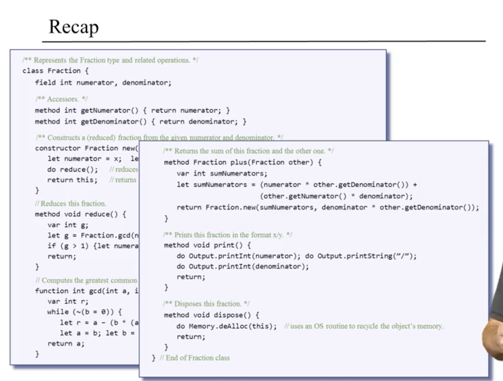
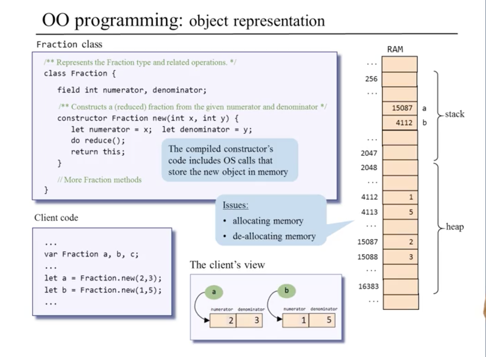
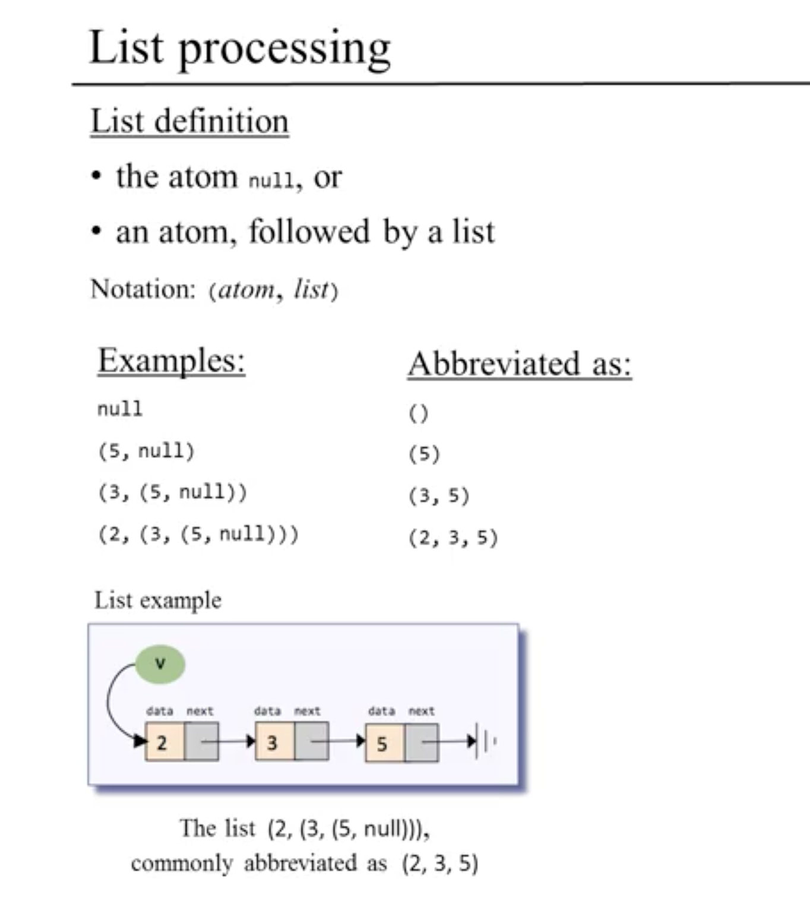
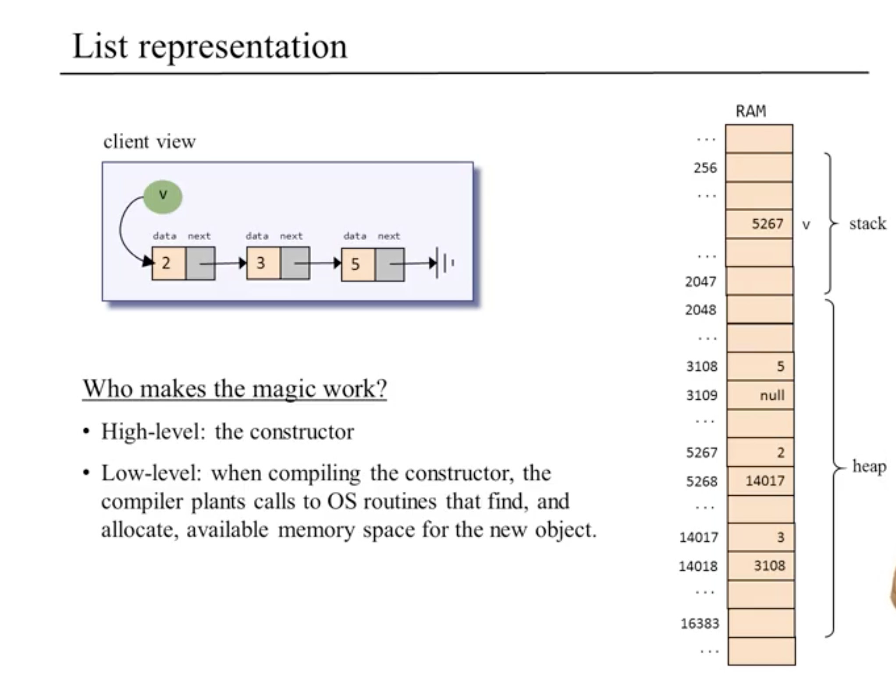
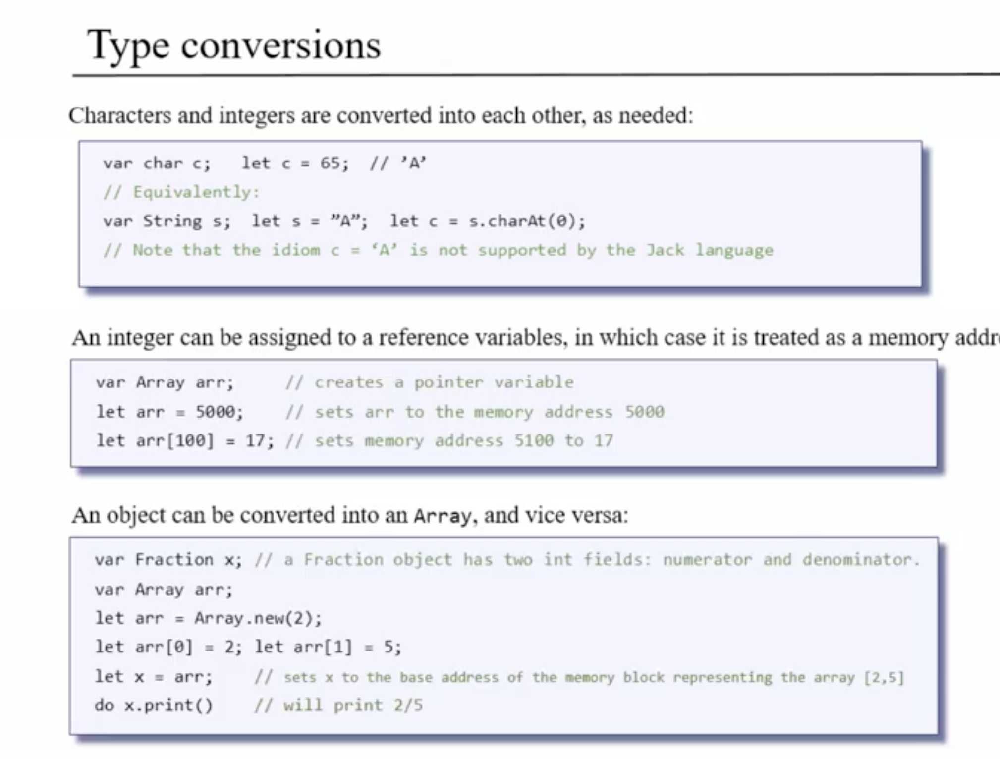
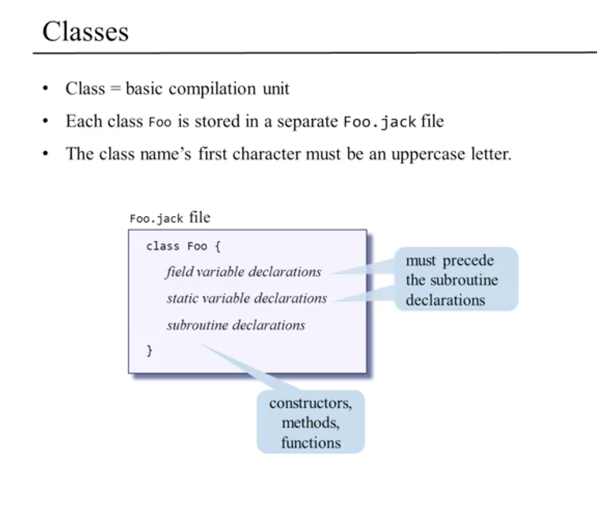
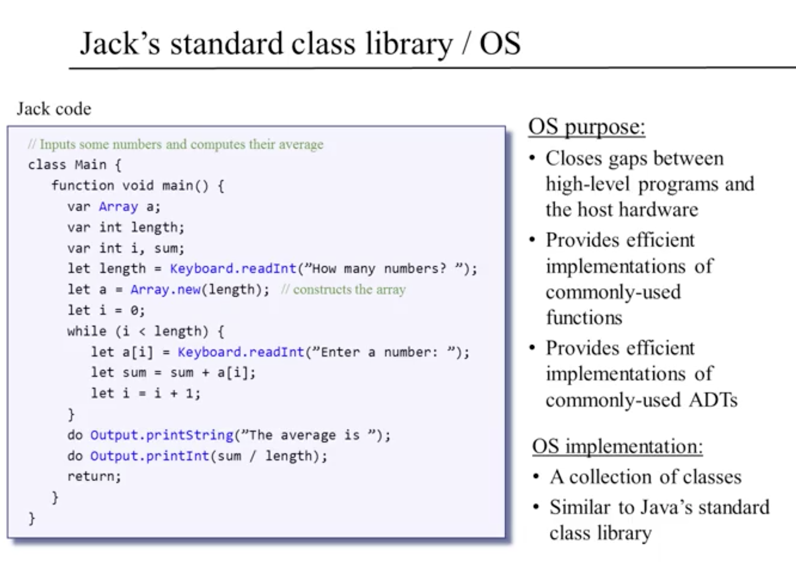
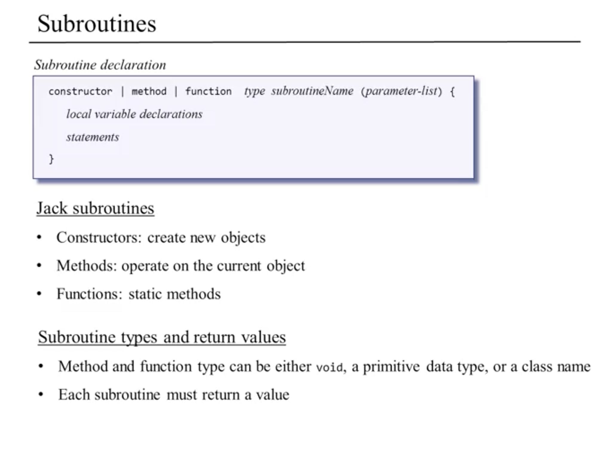
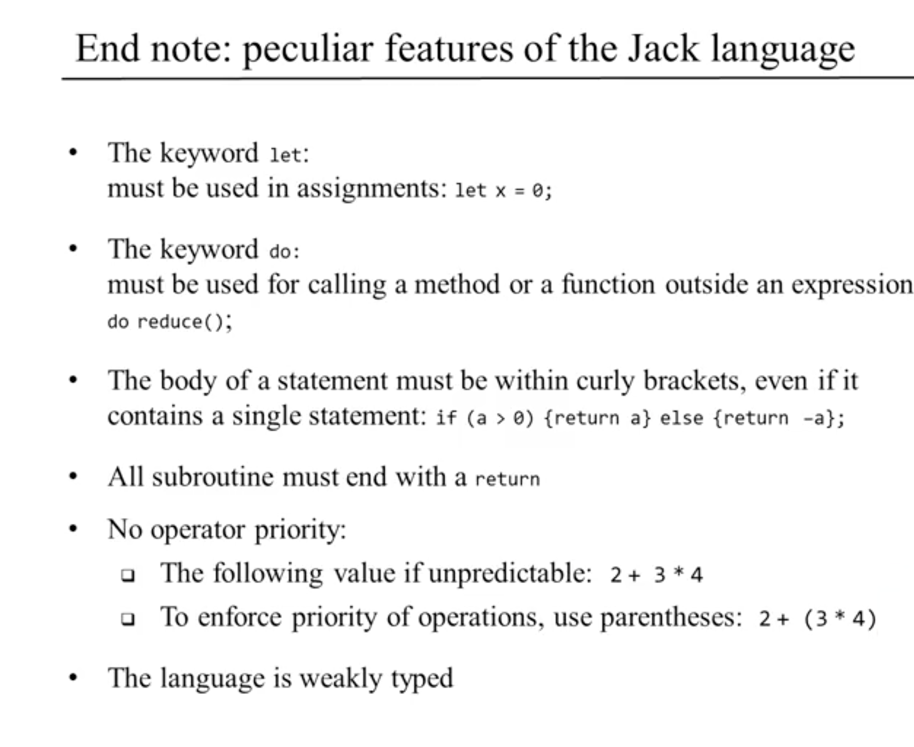

# High-Level Language

### Overview
* getting high-level overview of Jack in this module to later write compiler and OS in Jack
* Jack Program collection of one more classes, one of which must be called Main
  * must have at least one function named main
  * Main.main => program's entry point

### Object-Based Programming

* constructor => method designed to create new objects
  * must return the base address of the new object
    * Java does this implicitly must be explicit in Jack
* Object Representation
  * compiled constructor's code includes OS calls that store the new memory object
  

### List Processing
* 
  * the atom null, or
  * an atom followed by a list
* this => special variable that points to current object

### Jack Language Specification
* arrays and objects can be easily converted back and forth between one another because under the hood they are treated very similiarly
* 
* 
  * 
* 
  * functions -> don't understand what objects are and just perform some computational services
* 
