# Compiler 1: Syntax Analysis

### Overview
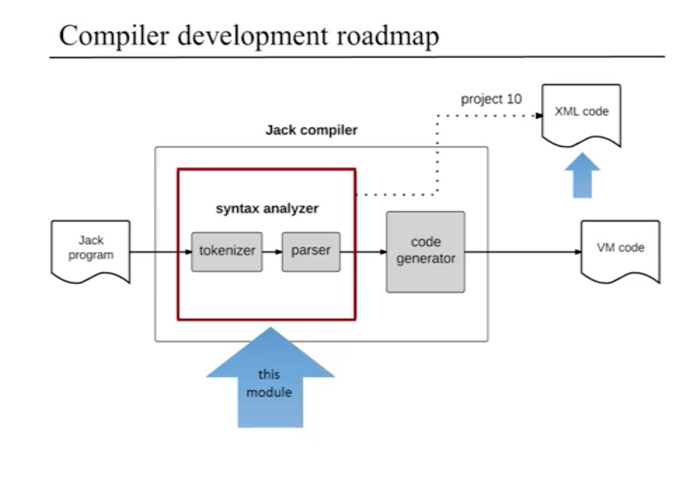
* process of translation from high-level to low-level consists two independent stages: syntax analysis and code generation
  * syntax analysis sub-stages
    * lexical analysis, or *tokenizing*
    * parsing
* Jack Analyzer -> program that unveils the syntax of the Jack program without generating executable code
  * result of syntax analysis

### Syntax Analysis
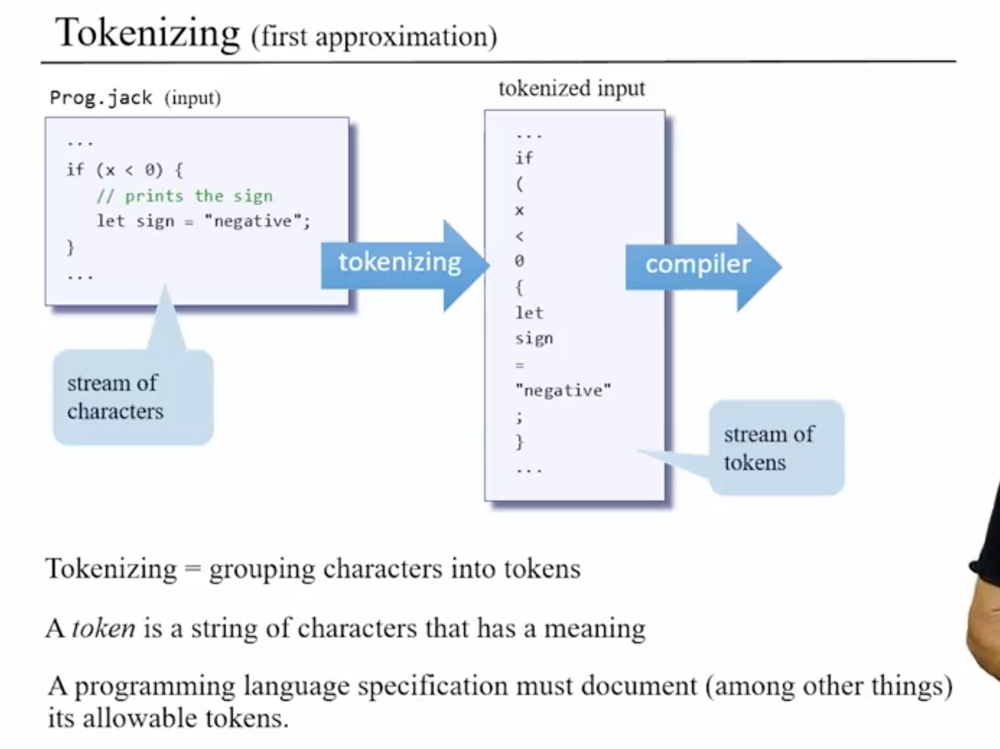
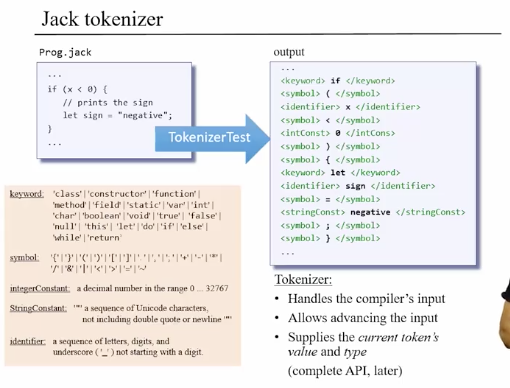

### Grammar
* program must abide by established grammar of compiler
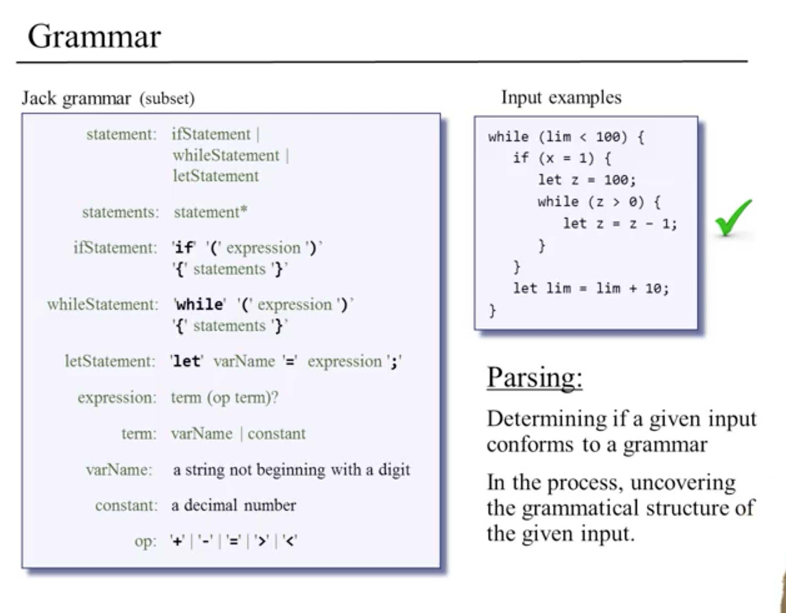

### Parse Tree
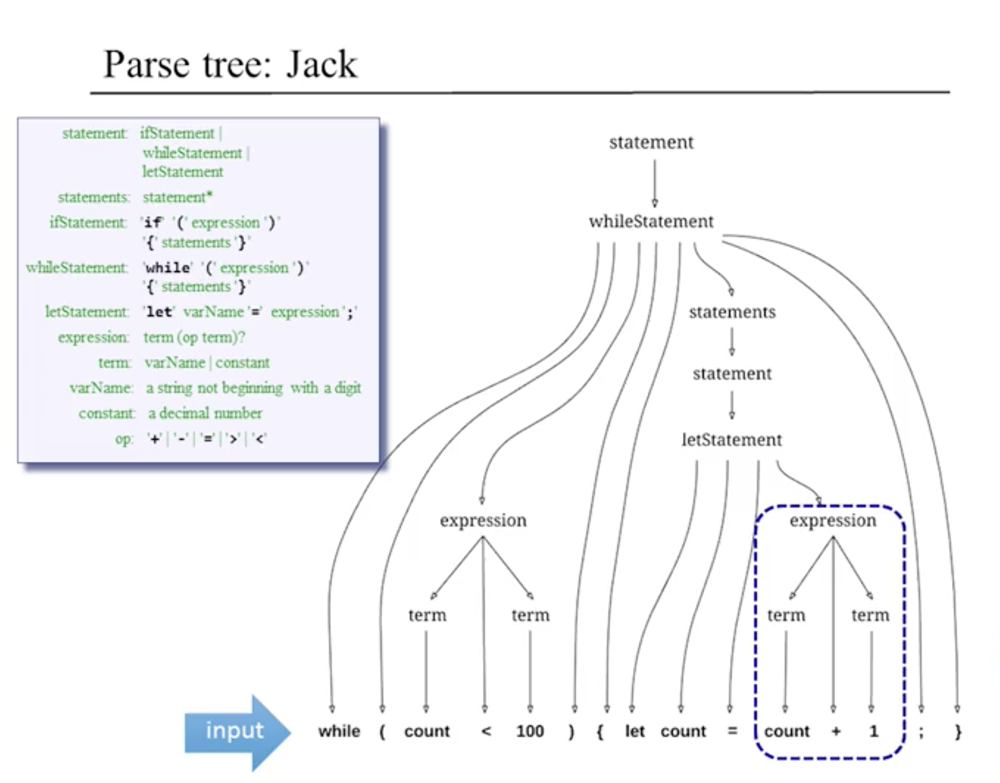
* parse tree -> recursive data type, where values may contain other values of the same type
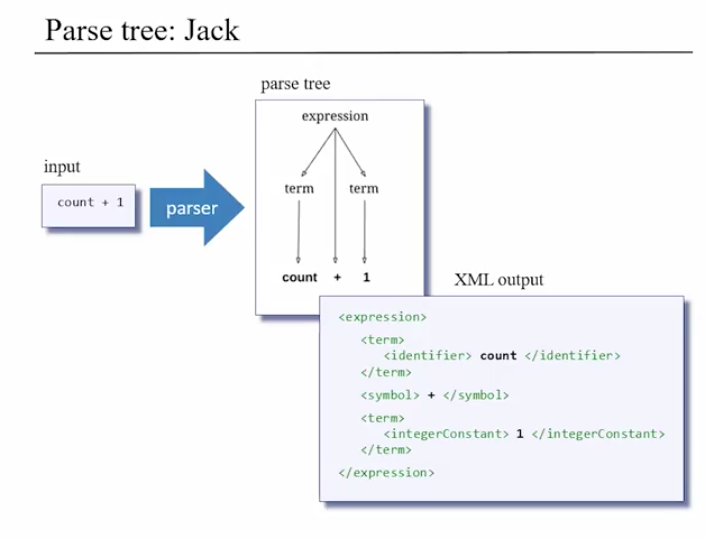

### Parser Logic
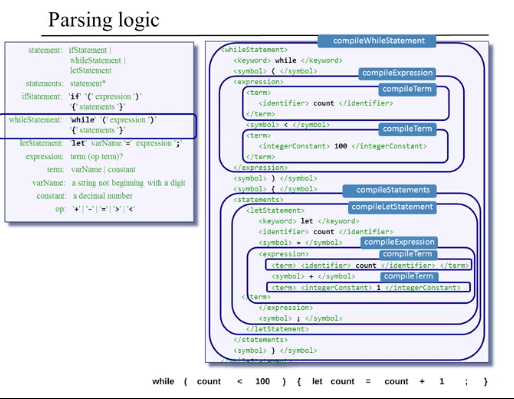
* non-terminals -> higher-level syntactic structure composed of terminals, or words, i.e., while, {}, etc.
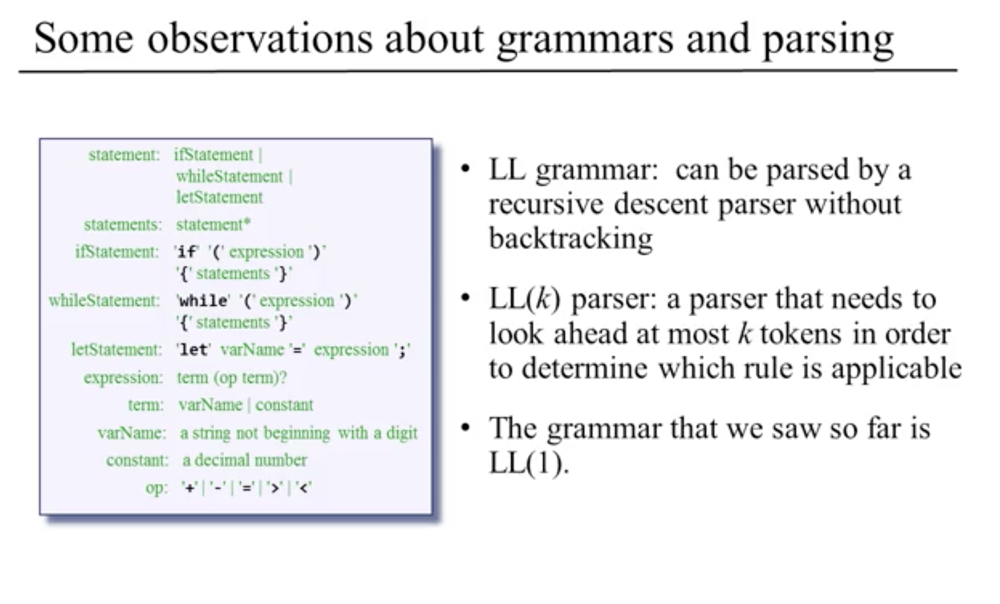
* programming languages much easier to parse than natural languages because only need to look ahead 1 token to understand current token, whereas in a language like English it may be 5-7 tokens

### The Jack Grammar
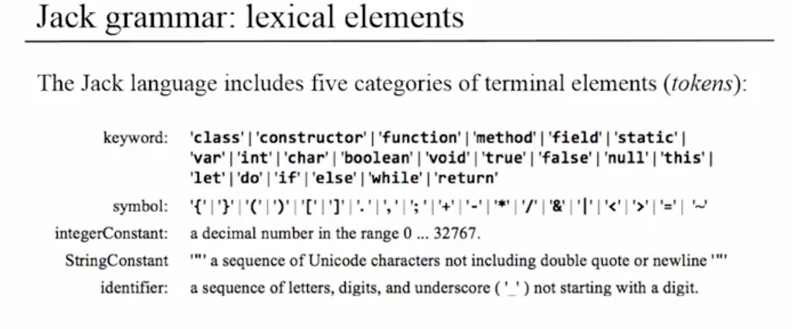
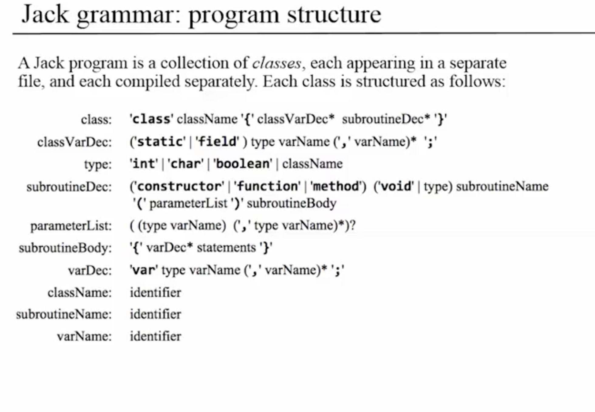
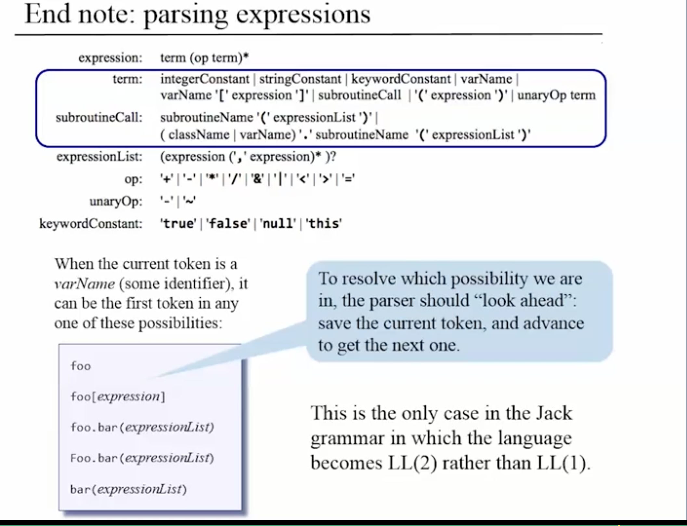
