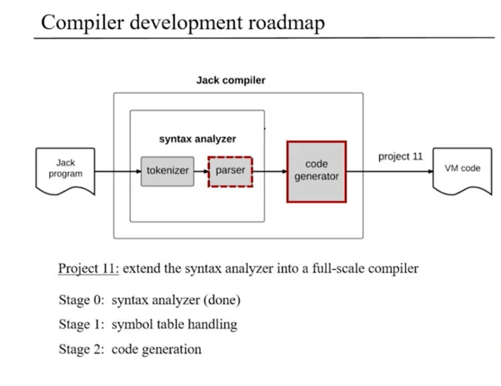
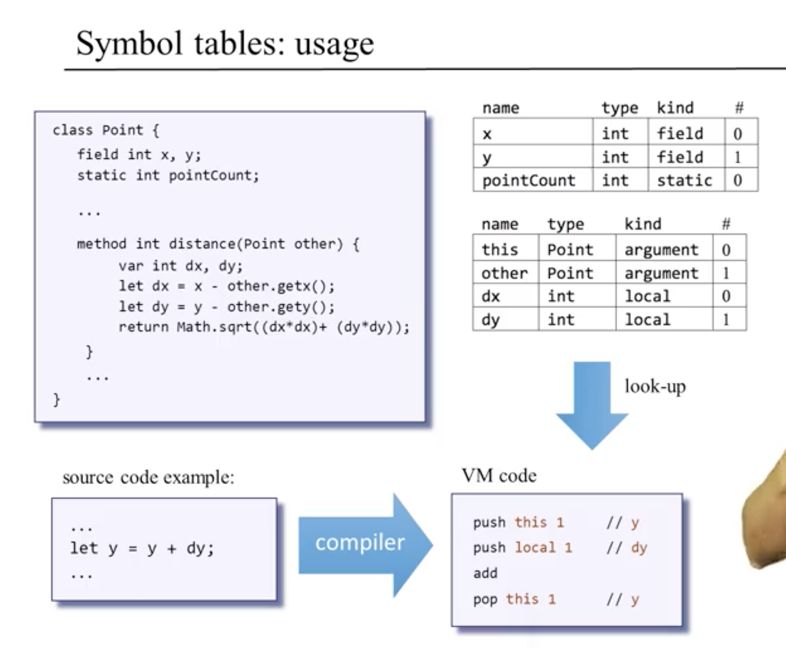
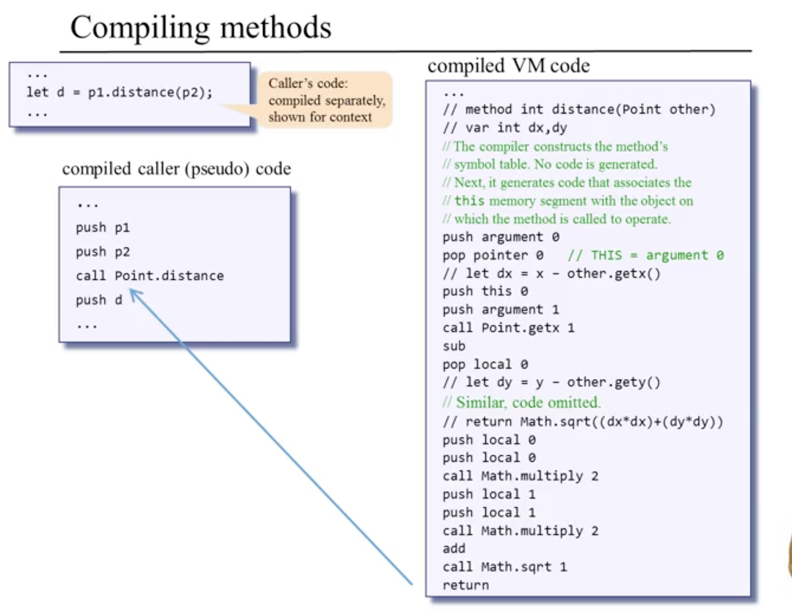

# Compiler 2: Code Generation

### Overview

* in Jack, like in Java and C#, **classes are standalone compilation units**

### Handling Variables

* use symbol tables at subroutine and class levels to keep track of variables
  * can reset for each class and subroutine

* **methods** of a class, in any language, **always pass current object / instance as first argument when invoked**

* current scope hides all the other scopes behind it
  * in Jack, we only have two scope levels: class and subroutine

### Handling Expressions

* all source languages use infix notation whereas vm code is postfix -> compile needs to make this translation
  
  * depth-first tree traversal can be used to make translation
  * will use recursive one-stage approach
  

### Handling Flow of Control
* make use of if-goto and labels in vm code

### Handling Objects: Low-Level Aspects
* Challenge of translating from high-level language to VM to Machine Code
* Memory Segments Refresher
  * need to write compiler that writes VM code
  * always use push / pop and the segment you want
  * VM code deals with host RAM
    * first 5 positions are pointers to designated segments in RAM
    * currently executing VM function has own stack frame with
    * Global Stack -> maintains currently executing function and its stacks as well other functions as they wait for the currently executing one to terminate
  
  
  

### Handling Objects Construction

* object construction two-stages
  * at compile time, declaring variables creates no VM code, but only modifies symbol table
  * at run time, the execution actually places the values of the object on the heap
* Memory.alloc -> returns the base address of the newly created object

### Handling Object Manipulation

* all oop method invocations automatically pass current object as implicit first argument
* **all subroutines must return an address or value to return back to location in RAM from which it was called**

### Handling Arrays

* virtual machines allow us to be oblivious of the surrounding hardware platform

### Standard Mapping over Virtual Machine
* at the VM level, all knowledge of function, method, constructor is lost -> everything is function at VM level

### Completing the Compiler

* Main Classes
  * JackCompiler
  * JackTokenizer
  * CompilationEngine
    * needs to be modified from previous project
  * SymbolTable
    * keeps track of all variables for the current class and subroutine
    * reset each time a new class or subroutine is started
  * VMWriter (writes VM Code)

### Project 11
* symbol table handling
  * implement symbol table
  * update compilation engine to use symbol table to output more specific identifier
* code generation

### Perspective
* Jack is Simple Language
  * lacks real type system
    * all variables are 16 bits
    * any type can be assigned to any other type
  * lacks inheritance
    * subclasses have a compiled time type and run time type
    * actual subtype not determined until runtime; methods looked up at runtime -> **late binding**
  * lacks public fields
* Compiler Optimization -> not necessarily important that compiler is efficient but that compiler generated efficient code
  * efficient code -> as few clock cycles and hardware resources as possible
* Follow Up ideas
  * extend Jack Compiler
  * further study compilers and languages via other courses and projects (teachyourselfcs)
