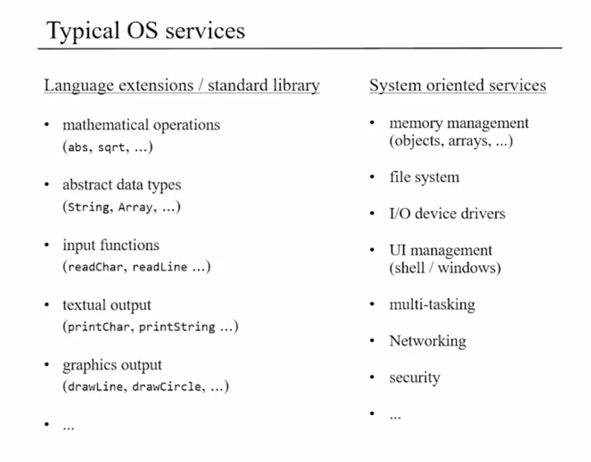

# Operating System

### Overview

* OS -> designed to close gaps between high level programming languages and the hardward on which they operate
  * i.e., accessing RAM, keyboard, screen, mathematical and string operations, etc.
  * effiency matters a lot for OS because all programs that run on top of it will be sluggish

### Efficiency Matters
* multiple two numbers using bit shifting and clever technique leads to log2N algorithm vs N algorithm for additive approach
* log2N much better than logN
  * each doubling of N only results in increase in 1 step for log2N algorithm
  * log2N -> depends on the number of digits of N

### Mathematical Operations
* implementation notes on Math Library for OS
  * algorithms for Mult, Div, and Sqrt make use of logN2 runtime algorithms

### Memory Access
* manage access to RAM in hack way by creating static array in Memory init that points at RAM 0
  * manipulating any part of RAM at will!

### Heap Management
* makes use of linked list directly in memory to manage free memory segments

### Textual Output
* Font Implementation
  * char mapping created from ascii number to numbers which represent whether a square is turned on in a grid -> forms each char

### Graphics
* Bitmap Graphics -> series of N-bit words telling screen which bits to turn on / off
* Vector Graphics -> instructions for how to draw graphics on screen
  * easy to transmit because of much smaller size
  * scales
  * turned into bitmap
* pixel drawing
  * space in RAM dedicated to screen
  * hardware refresh updates screen from RAM space regularily

### Line Drawing
* lines are only approximations on screen
  * need to turn on bits on screen that don't allow true line drawing

### Project 12
* OS -> abstraction with a set of API describing what is can for programmer
