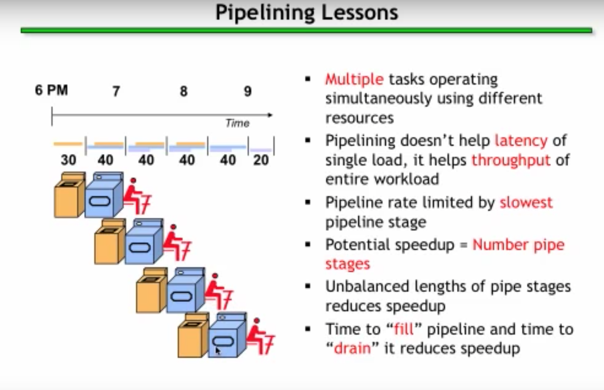
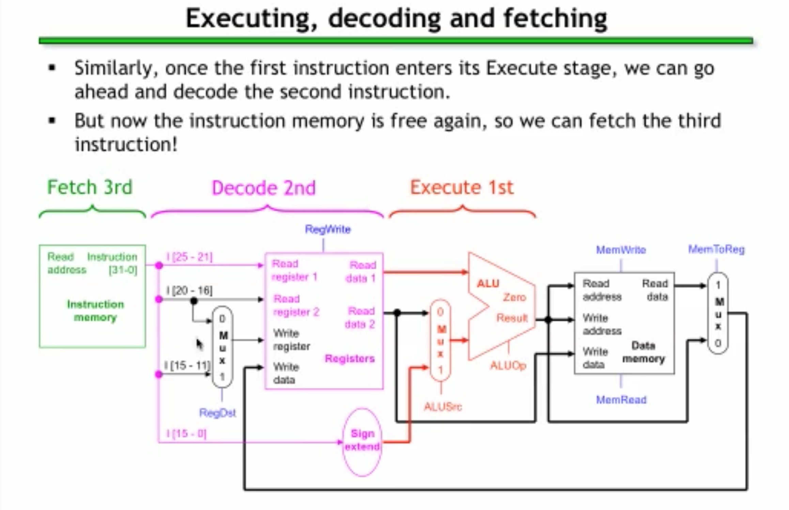
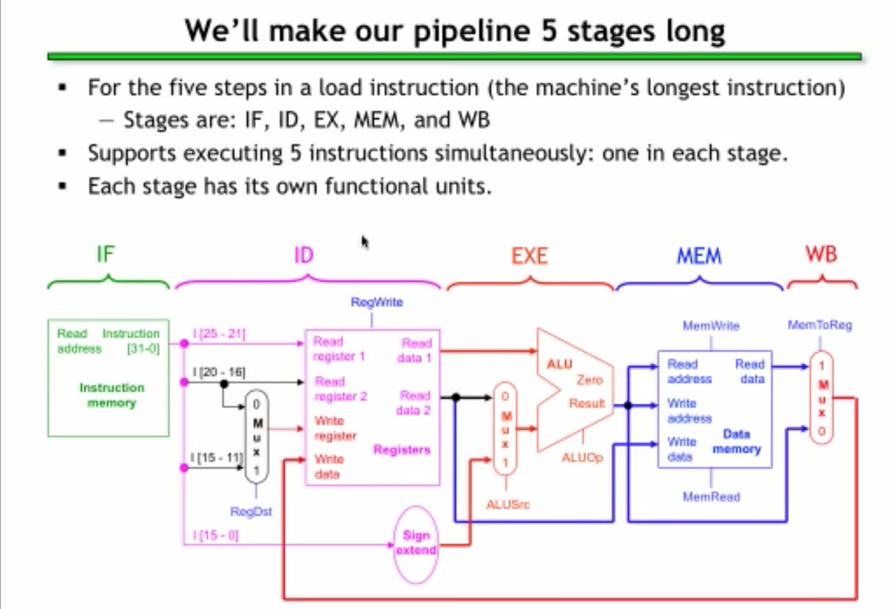

* Pipelining -> Breaking one task into a collection of sub-tasks
  * 
    * i.e., doing laundry where after the first wash load finishes, you put it in the dryed and start a new wash load, and finally folding
    * each assigned to its own resource: washer, dryer, or person
    * doesn't help latency of doing a single load, but it helps throughput of entire workload
      * able to a number of loads of laundry in less time than it would take if done sequentially
    * pipeline rate limited by slowest step
    * unbalanced lengths of pipe stages reduces speedup
      * faster parts left idle
    * time to "fill" and "drain" pipeline reduces speedup
  * ComputerPipeline
    * in one CPU clock cycle, there are components that could naturally remain idle after being used
    
    * optmizations made to have components begin next cycle once completing it's part in current cycle
    
    * computer broken into parts
    
