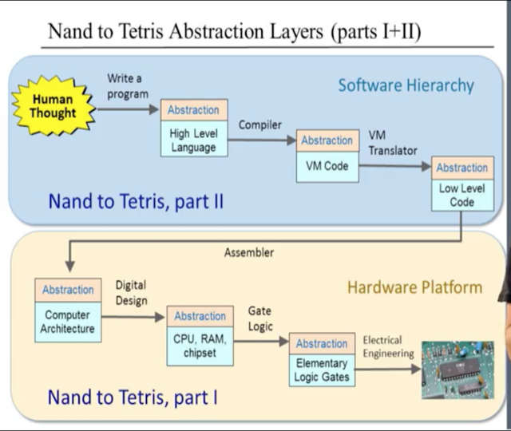

# Intro

### The Road Ahead

* Secret of computer science is forgetting the “How” (implementation details) at each level and only focusing on the “What”(interface Abstraction) of the system
* From Nand to Hack
  * Hardware engineers actually **build computers on computers with simulators**

### Boolean Functions and Gate Logic
##### Intro
* All computers built upon simple logic gates
* Nand gate: one of simplest logic gates
  * will build everything in this course upon it
* this chapeter will go deep over hardward overview
##### Boolean Logic
* Boolean Function -> operates on binary inputs and returns binary outputs
  * computer hardware is based on representation and specification of binary values, so boolean functions essential for specification, construction, and optimization of hardware architectures
  * Truth Table Representation -> simplest way to specify boolean function
    * enumerates all possible values of function input with corresponding outputs
  * Canonical Representation -> representing boolean function in 1 expression
    * "sum of products" and "products of sums" methods
  * Boolean Expressions
    ```
      xy -> x AND y
      x + y -> x OR y
      'x -> NOT x
    ```
  * Series of algebraic properties that can be applied to simplify expressions
##### Boolean Function Synthesis
* find simplest expression of boolean function NP complete problem
* NAND gate -> NEGATIVE AND
  * gives a value of 0 only if both are 1
  * any boolean function can be represented using NAND
##### Logic Gates
* Gate -> physical device that implements Boolean function
  * n input pins, m output pins corresponding to Boolean function
  * Transistors -> simplest gates of all made of tiny switching devices
  * today, most gates are implemented as transistors etched in silicon, packaged as chips
    * chips and gates words can be used interchangeably
  * gate designer cares about implementation details, or gate architecture
  * other designers use gate as off the shelf abstraction
* main goal in logic design is that gate implementation will reach its stated interface
* from an effiency standpoint, should try to do so in as few gates as possible
##### Hardware Desctiption Language
* Hardware Description Language -> enables construction of a chip by writing an HDL program, which is then subject to a battery of tests
  * software provides other metrics, such as computation speed, cost, energy consumption
  * allows you to define chip like defining any other sort of interfact / object
* HDL file -> textual description of gate diagram
* readability, documentation important just like in other langauges
* HDL used in course is similar to VHDL and Verilog, which dominate hardware design industry, but simpler
##### Hardware Simultation
* Hardware Simulator -> enable way to interact with and test hdl script
  * one for this course is relatively simple but provides everything needed for course
  * [tutorial](http://nand2tetris.org/tutorials/PDF/Hardware%20Simulator%20Tutorial.pdf)
#### Multi-Bit Buses
* enables handling group of multiple bits
* indexed from right to left
  * A[0] = right-most-bit, A[15] = left-most-bit
#### [Project 01](http://nand2tetris.org/01.php)
* building gates that most commonly used
* Multiplexor
  * 2-way multiplexor enables selecting, and outputting one out of two possible inputs
  * enables building programmable gate
  * "fanning out" -> input goes into multiple gates (i.e., And + Or)
* Demultiplexor
  * inverse of multiplexor -> distributes single input value into one of two possible destinations
* [Multiplexor & Demultiplexor use cases](https://www.elprocus.com/what-is-multiplexer-and-de-multiplexer-types-and-its-applications/)
* Tips
  * write out boolean algebra and transpose to diagrams
